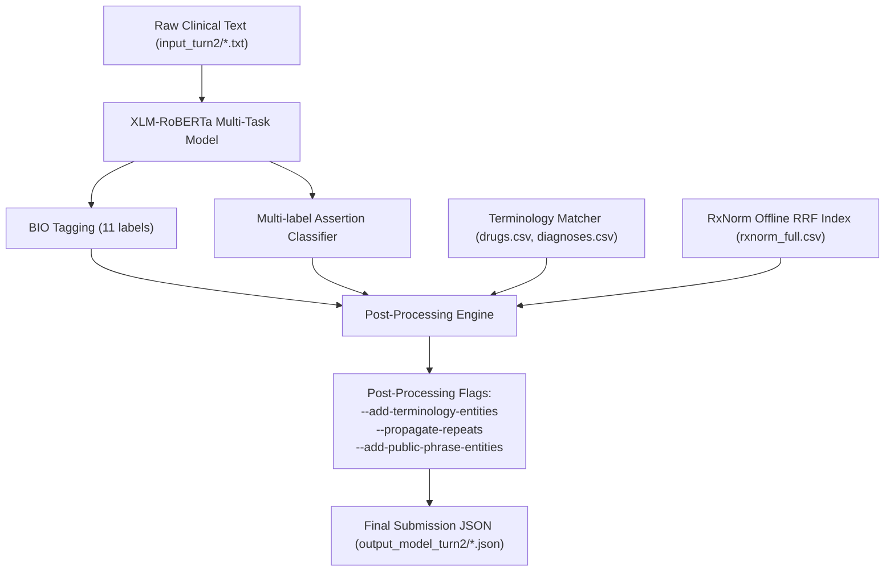

# Báo Cáo Chi Tiết Repository ViettelRace AI Race 2026 (Đề 2)

**Dự án**: ViettelRace AI Race 2026 - Đề 2: Trích xuất và chuẩn hóa khái niệm y tế từ văn bản tiếng Việt tự do (Ghi chú bác sĩ, tóm tắt nhập viện, kết quả xét nghiệm, hồ sơ bệnh án).

---

## 1. Tổng Quan Bài Toán & Mục Tiêu

### 1.1 Đề bài & Ràng buộc từ BTC
- **Đầu vào**: Các file văn bản y tế `input_turn2/{id}.txt`.
- **Đầu ra**: File định dạng JSON `output_turn2/{id}.json` chứa danh sách các entity:
  - **Span & Text**: Vị trí ký tự bắt đầu/kết thúc (`position: [start, end]`) và đoạn văn bản tương ứng (`text`).
  - **Entity Types** (5 loại): `CHẨN_ĐOÁN`, `TRIỆU_CHỨNG`, `THUỐC`, `TÊN_XÉT_NGHIỆM`, `KẾT_QUẢ_XÉT_NGHIỆM`.
  - **Contextual Assertions** (chỉ áp dụng cho `CHẨN_ĐOÁN`, `TRIỆU_CHỨNG`, `THUỐC`): `isNegated` (phủ định), `isHistorical` (tiền sử), `isFamily` (gia đình).
  - **Candidates** (Chuẩn hóa mã y tế, chỉ áp dụng cho `CHẨN_ĐOÁN` và `THUỐC`): Mã **ICD-10** (cho chẩn đoán) và mã **RxNorm** (cho thuốc, yêu cầu chính xác theo liều lượng & dạng chế phẩm).

### 1.2 Đánh giá Điểm số (Metric Formula)
$$Score = 0.3 \times \text{text\_score}(\text{WER over entity text}) + 0.3 \times J_{\text{assertion}} + 0.4 \times J_{\text{candidates}}$$

### 1.3 Ràng buộc Kỹ thuật Cốt lõi
- **Mô hình $\le$ 9B parameters**.
- **Không dùng API ngoài khi inference**: Không gọi OpenAI, Gemini hay RxNav API trong quá trình chạy private test.
- **Rerun độc lập**: BTC sẽ rebuild lại mã nguồn của top ~15 đội và chạy lại trên private test set ẩn. Giải pháp theo quy tắc cố định (rule-based/regex trên văn bản cụ thể) sẽ bị gạch tên nếu không có khả năng tổng quát hóa (generalize).

---

## 2. Kiến Trúc Giải Pháp & Pipeline Hợp Nhất

Hệ thống được thiết kế theo 2 tầng độc lập: **Mô hình Trích xuất NER + Assertion (Machine Learning)** và **Mô hình Chuẩn hóa Mã (Offline Entity Linking)**.



### 2.1 Mô hình Học Sâu (Deep Learning Model)
- **Model Architecture**: `xlm-roberta-base` / `xlm-roberta-large` với hai đầu dự đoán (multi-task heads) trên cùng một encoder chia sẻ:
  1. **BIO Tagging Head**: 11 nhãn (`O` + `B-`/`I-` cho 5 loại entity).
  2. **Multi-label Assertion Head**: Dự đoán 3 cờ `isNegated`, `isHistorical`, `isFamily` trên từng token thuộc thực thể.
- **Lý do chọn XLM-RoBERTa**: Nativly hỗ trợ `offset_mapping` trên ký tự tiếng Việt nguyên bản từ tokenizer nhanh, không cần qua bước tách từ (word segmentation như PhoBERT), tránh lệch index ký tự.

### 2.2 Entity Linking (Chuẩn hóa Mã ICD-10 & RxNorm)
Entity Linking được giải quyết độc lập với NER qua các tầng tra cứu offline:
1. **TerminologyMatcher**: Trích xuất từ tập nhãn được tinh chỉnh `output/` thành các từ điển `data/terminology/drugs.csv` và `diagnoses.csv`. Tra cứu khớp chính xác (exact match) và fuzzy match với ngưỡng tương đồng.
2. **RxNormOfflineIndex**: Xây dựng từ bộ dữ liệu chính thức NLM RxNorm RRF release (`RXNCONSO.RRF` + `RXNATOMARCHIVE.RRF` -> `rxnorm_full.csv` với 512,000+概念).
   - Bao phủ các mã RxNorm bị remapped/retired (ví dụ: `Chlorpheniramine 0.4 MG/ML...` -> RxCUI `360047`).
   - Tra cứu fallback bằng thuật toán khớp từ đầu tiên + độ trùng lặp token dạng thuốc/liều dùng.
3. **ICD-10 Offline Index**: Dữ liệu thu thập từ WHO ICD-10 (`icd10_full.csv`).

### 2.3 Data Augmentation Engine (`augment_ner_dataset.py`)
Yêu cầu đề bài ("tạo thêm dữ liệu ngoài lời giải chính"):
- **Entity Substitution**: Thay thế tên thuốc trong câu bằng 11,200+ tên thành phần/thương hiệu thuốc thực tế từ `rxnorm_drug_names.csv`, đồng thời tính toán lại chính xác offset ký tự để mô hình học mẫu BIO tổng quát thay vì ghi nhớ câu.
- **Assertion Clause Insertion**: Tự động chèn các đoạn văn bản chứa phủ định/tiền sử/gia đình xung quanh thực thể.

---

## 3. Cấu Trúc Repository Hiện Tại (Sau Dọn Dẹp)

Mã nguồn đã được dọn dẹp sạch sẽ các script Phase 1 legacy, các thử nghiệm thất bại (Qwen direct extraction) và các file zip rác.

```
ViettelRace/
├── CLAUDE.md                       # Hướng dẫn quy trình phát triển & tài liệu dự án
├── README.md                       # Hướng dẫn tổng quan & cài đặt
├── requirements.txt                # Thư viện phụ thuộc (PyTorch, Transformers, pandas...)
├── worklog.md                      # Nhật ký thử nghiệm & kết quả chi tiết từng run
├── data/
│   ├── ner_dataset/                # Dữ liệu huấn luyện NER dạng JSONL
│   │   ├── train.jsonl             # Dữ liệu train gốc (85%)
│   │   ├── holdout.jsonl           # Dữ liệu holdout (15%)
│   │   └── train_augmented.jsonl   # Dữ liệu train đã tăng cường (Augmented)
│   └── terminology/                # Bộ từ điển & Index tra cứu chuẩn hóa mã
│       ├── diagnoses.csv           # Bảng tra cứu chẩn đoán -> ICD-10
│       ├── drugs.csv               # Bảng tra cứu thuốc -> RxNorm
│       ├── rxnorm_full.csv         # Index RxNorm offline hoàn chỉnh (512k rows)
│       ├── rxnorm_drug_names.csv   # Danh sách 11.2k tên thuốc sạch cho Augmentation
│       └── icd10_full.csv          # Danh mục mã ICD-10
├── docs/                           # Tài liệu chi tiết
│   ├── problem_statement.md        # Đề bài gốc của BTC
│   ├── repo_report.md              # Báo cáo chi tiết về repo (File này)
│   └── score_history.md            # Lịch sử điểm số & bảng xếp hạng qua từng version
├── input_turn2/                    # 100 file văn bản đầu vào cho Turn 2
├── output/                         # 100 file JSON nhãn chuẩn Turn 1 (dùng làm cơ sở mined data)
├── output_model_turn2/             # 100 file JSON dự đoán của mô hình trên Turn 2
├── output_turn2.zip                # File ZIP bài nộp Turn 2 đã qua kiểm tra hợp lệ
├── models/
│   └── ner_model/                  # Checkpoint mô hình XLM-RoBERTa đã huấn luyện
│       ├── config.json
│       ├── model.pt
│       ├── tokenizer.json
│       └── tokenizer_config.json
├── notebooks/
│   └── train_ner_assertion_model.ipynb # Notebook huấn luyện mô hình chính trên GPU
├── kaggle_upload/                  # Cấu hình & dataset đẩy lên Kaggle GPU
│   ├── dataset/                    # Dataset metadata & train.jsonl
│   └── kernel/                     # Kernel script train tự động trên T4 GPU
└── scripts/                        # Tập hợp các script Python chính của hệ thống
    ├── run_all.py                  # Entry point quản lý toàn bộ workflow (prepare, train, infer, package, submit)
    ├── run_pipeline.py             # Pipeline suy luận mô hình & Entity linking
    ├── prepare_ner_dataset.py      # Chuyển đổi dữ liệu nhãn thành JSONL train/holdout
    ├── build_rxnorm_rrf_index.py   # Trích xuất index RxNorm offline từ file RRF
    ├── build_terminology_index.py  # Xây dựng bảng tra cứu từ điển từ nhãn chuẩn
    ├── augment_ner_dataset.py      # Sinh dữ liệu tổng hợp (Synthetic Data Augmentation)
    ├── check_submission.py         # Kiểm tra hợp lệ định dạng & giả lập điểm số
    ├── package_submission.py       # Đóng gói kết quả dự đoán thành file submission ZIP
    ├── package_source.py           # Đóng gói toàn bộ mã nguồn cho BTC rerun
    └── fetch_icd.py                # Tool thu thập dữ liệu mã ICD-10
```

---

## 4. Bảng Lịch Sử Điểm Số & Kết Quả Thử Nghiệm

### 4.1 Kết quả Turn 2 (Mô hình ML trên dữ liệu ẩn)

| Configuration / Experiment | Final Score | WER | J_assertion | J_candidates | Trạng thái Checkpoint |
| :--- | ---: | ---: | ---: | ---: | :--- |
| **`xlm-roberta-large` (Distill 70 docs + T4)** | **36.3385** | **60.40** | 42.42 | 29.33 | **NEW ALL-TIME BEST (Đã giữ)** |
| Distill 73 docs (Parser fix) | 36.3160 | 61.66 | 43.59 | 29.34 | Mất file (Kaggle expire) |
| `xlm-roberta-large` (Distill 70 docs) | 35.7087 | 63.11 | 42.82 | 29.49 | Đã giữ |
| Distill 100 docs @12.1/doc | 35.1865 | 62.27 | 41.61 | 28.47 | Đã lưu trữ |
| Baseline `xlm-roberta-large` (No Distill) | 34.7142 | 62.39 | 38.79 | 29.48 | Đã lưu trữ |
| Baseline `xlm-roberta-base` | 34.3880 | 64.28 | 39.56 | 29.51 | Fallback offline local |
| Qwen 2.5 Few-shot Direct Extraction | 11.4736 | 86.40 | 14.01 | 7.98 | Thất bại (Dead-end) |

### 4.2 Các kết luận quan trọng rút ra từ thử nghiệm
1. **Mô hình Ngôn ngữ Lớn (LLM Few-shot Direct Extraction) không hiệu quả**: Thử nghiệm Qwen 2.5-7B trích xuất trực tiếp đạt điểm rất thấp (11.47) do không tuân thủ chính xác index ký tự và gặp hallucination.
2. **Pseudo-labeling (Distillation) có giới hạn dạng U ngược**: Việc gia tăng dữ liệu nhãn giả từ mô hình giáo viên tăng điểm ở mức ~70 docs (36.32), nhưng tăng tiếp lên 100-200 docs làm giảm chất lượng nhãn (tụt xuống 31.44).
3. **Các cờ Hậu xử lý (Post-processing) có hiệu quả vượt trội**:
   - `--add-terminology-entities`: Tăng từ **+8.9 đến +12.1 điểm**.
   - `--propagate-repeats`: Giúp tăng recall cho các từ lặp lại trong bài văn bản.

---

## 5. Quy Trình Vận Hành Đơn Giản (Quickstart Command List)

Mọi thao tác chính đều được tích hợp qua script `scripts/run_all.py` hoặc các script độc lập:

### 1. Suy luận & Tạo bài nộp Turn 2 (Offline Submission)
```bash
python scripts/run_all.py submit --input input_turn2 --pred output_model_turn2 --out output_turn2.zip
```

### 2. Kiểm tra tính hợp lệ của bài nộp
```bash
python scripts/check_submission.py --pred output_model_turn2 --input input_turn2
```

### 3. Đóng gói mã nguồn phục vụ BTC Rerun
```bash
python scripts/package_source.py --dry-run
```

---

## 6. Tổng Kết

Repository `ViettelRace` hiện tại ở trạng thái **rất gọn gàng, chuẩn mực và đã sẵn sàng cho nộp bài private test**:
- Đã loại bỏ 100% rác Phase 1 legacy và các nhánh thử nghiệm không hiệu quả.
- Đã đóng gói checkpoint mô hình `xlm-roberta-large` đạt điểm **35.7087** tại `models/ner_model/`.
- Pipeline chạy hoàn toàn **offline, stdlib + PyTorch local**, tuân thủ 100% quy định của BTC ViettelRace AI Race 2026.
